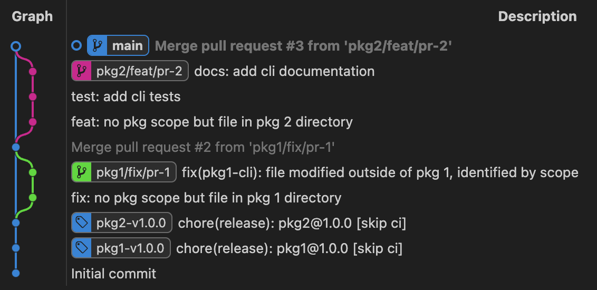
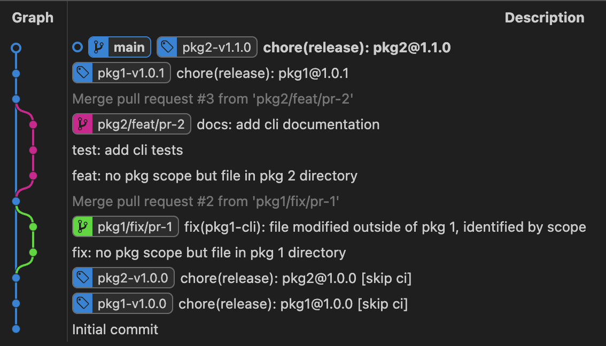

.. _monorepos:

Releasing Packages from a Monorepo
==================================

A monorepo (mono-repository) is a software development strategy where code for multiple projects is stored in a single source control system. This approach streamlines and consolidates configuration, but introduces complexities when using automated tools like Python Semantic Release (PSR).

Previously, PSR offered limited compatibility with monorepos. As of v10.4.0, PSR introduces the :ref:`commit_parser-builtin-conventional-monorepo`, designed specifically for monorepo environments. To fully leverage this new parser, you must configure your monorepo as described below.

.. _monorepos-config:

Configuring PSR
---------------

.. _monorepos-config-example_simple:

Example: Simple
"""""""""""""""

**Directory Structure**: PSR does not yet support a single, workspace-level configuration definition. This means each package in the monorepo requires its own PSR configuration file. A compatible and common monorepo file structure looks like:

.. code::

    project/
    ├── .git/
    ├── .venv/
    ├── packages/
    │   ├── pkg1/
    │   │   ├── docs/
    │   │   │   └── source/
    │   │   │       ├── conf.py
    │   │   │       └── index.rst
    │   │   │
    │   │   ├── src/
    │   │   │   └── pkg1/
    │   │   │       ├── __init__.py
    │   │   │       ├── __main__.py
    │   │   │       └── py.typed
    │   │   │
    │   │   ├── CHANGELOG.md
    │   │   ├── README.md
    │   │   └── pyproject.toml             <-- PSR Configuration for Package 1
    │   │
    │   └── pkg2/
    │       ├── docs/
    │       │   └── source/
    │       │       ├── conf.py
    │       │       └── index.rst
    │       ├── src/
    │       │   └── pkg2/
    │       │       ├── __init__.py
    │       │       ├── __main__.py
    │       │       └── py.typed
    │       │
    │       ├── CHANGELOG.md
    │       ├── README.md
    │       └── pyproject.toml             <-- PSR Configuration for Package 2
    │
    ├── .gitignore
    └── README.md

This is the most basic monorepo structure, where each package is self-contained with its own configuration files, documentation, and CHANGELOG files. To release a package, change your current working directory to the package directory and execute PSR's :ref:`cmd-version`. PSR will automatically read the package's ``pyproject.toml``, looking for the ``[tool.semantic_release]`` section to determine the package's versioning and release configuration, then search up the file tree to find the Git repository.

Because there is no workspace-level configuration, you must duplicate any common PSR configuration in each package's configuration file. Customize each configuration for each package to specify how PSR should distinguish between commits.

With the example file structure above, here is an example configuration file for each package:

.. code-block:: toml

    # FILE: pkg1/pyproject.toml
    [project]
    name = "pkg1"
    version = "1.0.0"

    [tool.semantic_release]
    commit_parser = "conventional-monorepo"
    commit_message = """\
    chore(release): pkg1@{version}`

    Automatically generated by python-semantic-release
    """
    tag_format = "pkg1-v{version}"
    version_toml = ["pyproject.toml:project.version"]

    [tool.semantic_release.commit_parser_options]
    path_filters = ["."]
    scope_prefix = "pkg1-"

.. code-block:: toml

    # FILE: pkg2/pyproject.toml
    [project]
    name = "pkg2"
    version = "1.0.0"

    [tool.semantic_release]
    commit_parser = "conventional-monorepo"
    commit_message = """\
    chore(release): pkg2@{version}`

    Automatically generated by python-semantic-release
    """
    tag_format = "pkg2-v{version}"
    version_toml = ["pyproject.toml:project.version"]

    [tool.semantic_release.commit_parser_options]
    path_filters = ["."]
    scope_prefix = "pkg2-"

These are the minimum configuration options required for each package. Note the use of :ref:`config-tag_format` to distinguish tags between packages. The commit parser options are specific to the new :ref:`commit_parser-builtin-conventional-monorepo` and play a significant role in identifying which commits are relevant to each package. Since you are expected to change directories to each package before releasing, file paths in each configuration file should be relative to the package directory.

Each package also defines a slightly different :ref:`config-commit_message` to reflect the package name in each message. This helps clarify which release number is being updated in the commit history.

Release Steps
'''''''''''''

Given the following Git history of a monorepo using a GitHub Flow branching strategy (without CI/CD):

To manually release both packages, run:

.. code-block:: bash

    cd packages/pkg1
    semantic-release version
    # 1.0.1 (tag: pkg1-v1.0.1)

    cd ../pkg2
    semantic-release version
    # 1.1.0 (tag: pkg2-v1.1.0)

After releasing both packages, the resulting Git history will look like:

.. seealso::

    - :ref:`GitHub Actions with Monorepos <gh_actions-monorepo>`

Considerations
''''''''''''''

1. **Custom Changelogs**: Managing changelogs can be tricky depending on where you want to write the changelog files. In this simple example, the changelog is located within each package directory, and the changelog template does not have any package-specific formatting or naming convention. You can use one shared template directory at the root of the project and configure each package to point to the shared template directory.

.. code-block:: toml

    # FILE: pkg1/pyproject.toml
    [tool.semantic_release]
    template_dir = "../../config/release-templates"

.. code-block:: toml

    # FILE: pkg2/pyproject.toml
    [tool.semantic_release]
    template_dir = "../../config/release-templates"

.. code::

    project/
    ├── .git/
    ├── config/
    │   └── release-templates/
    │       ├── CHANGELOG.md.j2
    │       └── .release_notes.md.j2
    ├── packages/
    │   ├── pkg1/
    │   │   ├── CHANGELOG.md
    │   │   └── pyproject.toml
    │   │
    │   └── pkg2/
    │       ├── CHANGELOG.md
    │       └── pyproject.toml
    │
    ├── .gitignore
    └── README.md

.. tip::
   If you want changelogs written to a different directory (such as a package-specific
   documentation folder), use the :ref:`output_dir <config-changelog-output_dir>` setting

   .. code-block:: toml

       # FILE: pkg1/pyproject.toml
       [tool.semantic_release.changelog]
       output_dir = "docs"

   This writes the changelog to ``pkg1/docs/CHANGELOG.md`` using the default template,
   without needing custom templates. See the :ref:`Advanced Example <monorepos-config-example_advanced>`
   for consolidated documentation across packages.

.. seealso::

    - For situations with more complex documentation needs, see our :ref:`Advanced Example <monorepos-config-example_advanced>`.

2. **Package Prereleases**: Creating pre-releases is possible, but it is recommended to use package-prefixed branch names to avoid collisions between packages. For example, to enable alpha pre-releases for new features in both packages, use the following configuration:

.. code-block:: toml

    # FILE: pkg1/pyproject.toml
    [tool.semantic_release.branches.alpha-release]
    match = "^pkg1/feat/.+"                       # <-- note pkg1 prefix
    prerelease = true
    prerelease_token = "alpha"

.. code-block:: toml

    # FILE: pkg2/pyproject.toml
    [tool.semantic_release.branches.alpha-release]
    match = "^pkg2/feat/.+"                       # <-- note pkg2 prefix
    prerelease = true
    prerelease_token = "alpha"

----

.. _monorepos-config-example_advanced:

Example: Advanced
"""""""""""""""""

If you want to consolidate documentation into a single top-level directory, use the
:ref:`output_dir <config-changelog-output_dir>` setting to write changelogs directly
to package-specific documentation folders.

The directory structure looks like:

.. code::

    project/
    ├── .git/
    ├── docs/
    │   └── source/
    │       ├── pkg1/
    │       │   ├── changelog.md
    │       │   └── README.md
    │       ├── pkg2/
    │       │   ├── changelog.md
    │       │   └── README.md
    │       └── index.rst
    │
    ├── packages/
    │   ├── pkg1/
    │   │   ├── src/
    │   │   │   └── pkg1/
    │   │   │       ├── __init__.py
    │   │   │       └── __main__.py
    │   │   └── pyproject.toml
    │   │
    │   └── pkg2/
    │       ├── src/
    │       │   └── pkg2/
    │       │       ├── __init__.py
    │       │       └── __main__.py
    │       └── pyproject.toml
    │
    └── README.md

Here is the configuration file for package 1:

.. code-block:: toml

    # FILE: packages/pkg1/pyproject.toml
    [project]
    name = "pkg1"
    version = "1.0.0"

    [tool.semantic_release]
    commit_parser = "conventional-monorepo"
    commit_message = """\
    chore(release): Release `pkg1@{version}`

    Automatically generated by python-semantic-release
    """
    tag_format = "pkg1-v{version}"
    version_toml = ["pyproject.toml:project.version"]

    [tool.semantic_release.commit_parser_options]
    path_filters = [
        ".",
        "../../docs/source/pkg1/**",
    ]
    scope_prefix = "pkg1-"

    [tool.semantic_release.changelog]
    output_dir = "../../docs/source/pkg1"
    mode = "update"
    exclude_commit_patterns = [
        '''^chore(?:\([^)]*?\))?: .+''',
        '''^ci(?:\([^)]*?\))?: .+''',
        '''^refactor(?:\([^)]*?\))?: .+''',
        '''^style(?:\([^)]*?\))?: .+''',
        '''^test(?:\([^)]*?\))?: .+''',
        '''^Initial [Cc]ommit''',
    ]

    [tool.semantic_release.changelog.default_templates]
    changelog_file = "changelog.md"

Package 2 follows the same pattern with its own paths and scope prefix.

Note: We added path filters for documentation files related to the package so that
documentation changes are included in the changelog.

To release a package, simply run:

.. code-block:: bash

    cd packages/pkg1
    semantic-release version

The changelog will be written directly to ``docs/source/pkg1/changelog.md``.

.. tip::
   For custom changelog formatting beyond the defaults, you can still use a custom
   ``template_dir``. The ``output_dir`` setting controls where all templates (default
   or custom) are rendered. See :ref:`changelog-templates` for template customization.

.. seealso::

    - Example Monorepo: `codejedi365/psr-monorepo-poweralpha <https://github.com/codejedi365/psr-monorepo-poweralpha>`_
